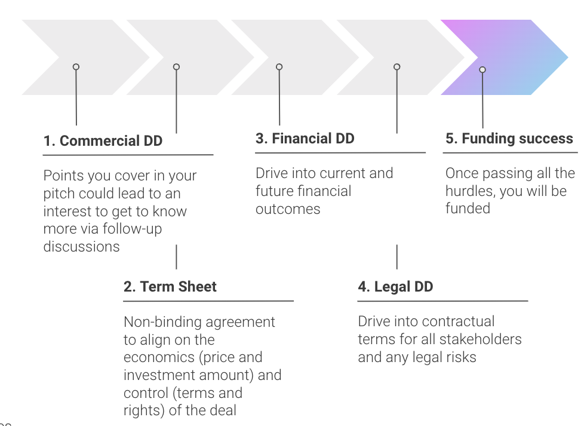

import ListAdmonition from '@site/src/components/ListAdmonition';

<ListAdmonition>
    <ul>
        <li> What is investor due diligence</li>
        <li> The value of an appendix in a pitch deck</li>
        <li>Standard documents to include in a pitch deck </li>
     </ul>
</ListAdmonition>

## Introduction

Due diligence (or DD) is an important step in the closing of any financing round. As founders or project leaders, your job is to turn the initial "yes" into a final "yes" and get money in the bank. So the smoother you can make this for an investor, the higher the likelihood of conversion. Beware that the process is typically a good test of investor / investee fit, meaning if you can't work together on this process, then it's a big warning sign that a future working relationship will be tenuous.

## Your pitch deck appendix is the start

As discussed in the article "[How to prepare your pitch](how-to-prepare-your-pitch)", a great set of appendices is worth its weight in gold in your pitch deck, as it is the perfect starting point to get the investor to get comfortable with the details of your business. Recall the list of example topics to cover in your appendix include:

- Revenue opportunities and detailed road maps
- Financial models and cash flow forecasts
- Competitive analysis and market analysis
- Detailed team, investor and partner profiles
- Tokenomics breakdown
- Technical architecture diagrams

## Getting your data room ready

A due diligence process will cover a range of topics which are material to your business. These include commercial information which covers your market analysis, your product strategy and potential plans to go-to-market, to financial and legal information which as the names suggest cover the detailed nuts and bolts of your financial and legal position.

A typical flow of process from initial pitch to funding success is as follows:

To help structure the conversation and respond to data requests, it's a good idea to organise and compile a list of important documents within a shared drive. Typically you'd use Google Drive, Dropbox or OneDrive for this. The documents should include those required to do the full commercial, financial and legal due diligence on you. Note you don't need to worry if not all documents are in place at the very start, you can progressively add more information, but it's great to be on the front foot.

A suggested list of documents for your project includes:

- User acquisition and retention stats
- Detailed tech architecture documentation
- Team overview outlining relevant experience (CV if possible)
- Game design
- Tokenomics
- Company registration, members register, constitution and board minutes
- Company bank statements
- Competitor and market analysis (SWOT)
- Strategy documents
- Demo accounts & beta access of upcoming launches
- Partnership agreements and licence agreements
- Material customer and supplier agreements
- Trademarks, copyright and patents
- Employment contracts
- Financial cashflow projections

## Not all investors are the same

A theme we followed in this section of how to raise funding is that not all investors are the same, this means some investors will want more information on certain topics whilst others may be a little more loose with their information requests. You need to [understand the investor](understanding-the-investor) in order to be the best judge of how much detail you go into.

Agreeing upfront as to what are the topic areas of interest is usually a great starting point, when you get beyond the basic set of information above. Specifically it's important to discern what's nice to have and what's must have information.

