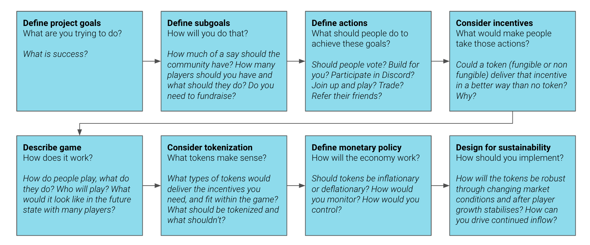

**Introduction**

This template is a rough guideline to determine your approach to tokenization.

**Prerequisites**

- Core tokenomic concepts
- Designing an in-game economy

## **Template**

1.  Fill in the following template

1.  Review these additional points

Once you've filled in the above,

**Check your initial decisions for simplicity:** fewer tokens and simpler interactions are easier to control. Reassess your outputs from the exercise against the project's goals - are they the most effective way to incentivize the behaviours you want and achieve your project's goals?

**Check your initial decisions for the end state:** reassess your outputs from the exercise against the future state of your game. Will the decisions still make sense in a strong bear or bull market? Will they make sense in several months when player growth slows or stabilizes? Will they make sense in several years if you have millions of players? Are you building in enough control to be able to guide the economy?

**Identify legal and compliance issues:** with growing regulations around crypto, some elements of your initial focus areas may need legal and compliance sign-off. This content does not constitute legal or financial advice but will help frame the decisions and concepts you should validate with experts for your situation.

**Define path forward:** decide on the next decisions to finalize design and a timeline for implementation. An important note here is that game launch and tokenomic launch do not have to coincide. Your game can go live and begin to grow players while you plan for a tokenomic implementation in subsequent phases, which will give you more data to refine your thinking