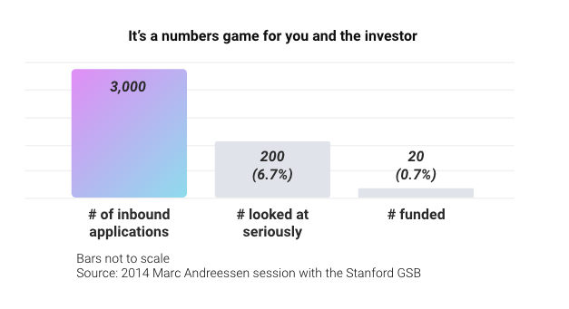
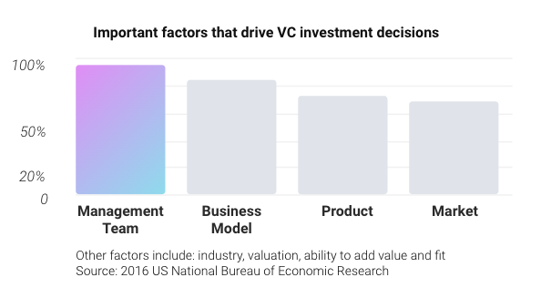

import ListAdmonition from '@site/src/components/ListAdmonition';

<ListAdmonition>
    <ul>
        <li>Basic questions to ask when researching an investor</li>
        <li> How to target the right investor</li>
        <li> How an investor thinks </li>
     </ul>
</ListAdmonition>

## Introduction

Raising money is like any other marketing and sales activity - you need to start with the key stakeholders. In this case, it's the investor.

It's important to consider:

1. What is it they're looking for?
2. How do you best provide the narrative and story to fit this?
3. Are they the right investor for you?

Answering these questions before you start the process can save so much heartache, and greatly enhance your likelihood of success.

Firstly, accept the fact that you will not only have a single story for your pitch, you will have multiple. The reason is different investors might be looking for different things. They might have a common thread - which is what forms your primary pitch, but be prepared to evolve this for each individual investor you decide to target.

## Targeting the right investor

One useful way to think about who should be your target investor is via a process of reflection and research. Ideally investors should be complementary to your capability needs as a team, not only fulfilling your need for money to fund your project. The right investor should have a multiplying impact on your project.

Some expertise areas to help you prioritize include:

- Game building and publishing
- Web3 project launch, community building and tokenomics
- Early stage company building and team building
- Late stage exit, listing and M&A
- Unfair advantage in helping you acquire customers or build credibility

Additionally, it's important to match the stage of your company to the investor's investment mandate (the self-imposed rules which restrict their investment). Typically you can find the funds' investment mandate via their website or any public announcements they've made about their new fund. Important things to consider here are:

- Cheque sizes
- Stage of business and stage of funds
- Geographical remit

## How an investor thinks

One useful exercise is to project how your target investor might think. You get a real sense of this via their opinions both publicly and privately. Public opinions are often quite easy to gather in this day and age. Our advice is to research heavily here so you can work out exactly why it makes sense for the investor to give you their time to listen to your pitch. You can find their opinions via:

- LinkedIn or Twitter posts
- Blogposts and memos which detail previous investments
- Media interviews via events or podcasts

Some truisms to navigate are as follows:

- The best investors will go through lots of deals, and typically will have the ability to pick and choose between the best high potential opportunities.

- Investors typically like investing in what they know, and they'll do the work to learn where there are knowledge gaps. They may have already spoken to your partners and competitors to understand your field.
- Investors think about "derisking" - while they embrace high risk, high reward opportunities, they want to understand how you plan to "derisk" the investment for them.
- Founder and team are often the most important factors. In Web3, this extends also to community (ie Product / Founder / Community fit).

Further, as marketing conditions change, investors will be more likely to scrutinize execution and traction metrics. Typical areas investors want more certainty are:

- Compelling and live product with engaged users
- Robust go-to-market strategy that's somewhat tested
- Good baseline traction metrics with momentum
- Founders and team with unique insight to win the market

## Further reading
- [Common investor questions](common-investor-questions)
- [Factors that drive decision making](https://www.nber.org/digest/dec16/how-do-venture-capitalists-make-decisions)
- [Marc Andreessen session with Stanford GSB](https://www.youtube.com/watch?v=JYYsXzt1VDc)