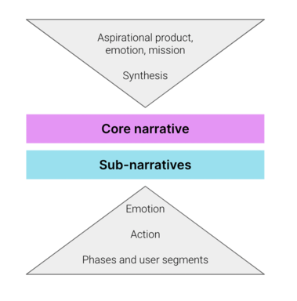

import ListAdmonition from '@site/src/components/ListAdmonition';

<ListAdmonition>
    <ul>
        <li>What is a sub-narrative</li>
        <li>How to use sub narratives to cater to different audiences</li>
    </ul>
</ListAdmonition>

## Introduction

Sub-narratives are the "secret sauce" and differentiate a successful Web3 project. They are an intentional mapping of the core and sub-narratives through time. They work together with marketing and community activities to amplify and propagate your project messaging. At their core sub-narratives exist because they contextualize your narrative for your various audiences.

Here are two key segments of Web3 games:

- **Players** , who are seeking entertainment. Attracting players is critical for the success of the project and needs to be the priority: a growing player base inherently attracts the other user segments due to speculation.
- **Participants** , who are seeking income either by interacting with market elements (flipping NFTs or gaming the economy), or directly playing to earn. Attracting participants brings liquidity and market activity to the project.

Sub-narratives cascade from your core narrative and allow you to target these user segments effectively.

## How do I get started with sub-narratives?

A good starting point is [understanding your customer segments](../learn/../web3-marketing-and-community/customer-segmentation-in-web3.md). Understanding the different needs and motivations between Players and Participants is critical in forming the right narrative and communication strategies. Once you understand the customer, you can work backwards from desired actions you want them to perform, emotional levers which you need to heighten to drive the desired actions. The template below can be used as a guide.

## Template: Putting core and sub-narratives together

As you can see, the sub-narratives really evolve over time for your audiences. While these evolve, your core narrative should be unwaveringly consistent. This means that to put it all together, aligning top down and bottom up is important.

In order to get to your core-narrative, you're working top down

1. What's your product, emotion and mission?
2. Sum it up in several sentences

To work out your sub-narratives, you're working from the bottom up

1. What are the phases of your project?
2. Which user segment(s) need focus?
3. What actions do you want people to take in them?
4. What emotions will drive those actions?
5. What sub-narratives evoke those emotions that tie into your core narrative?

