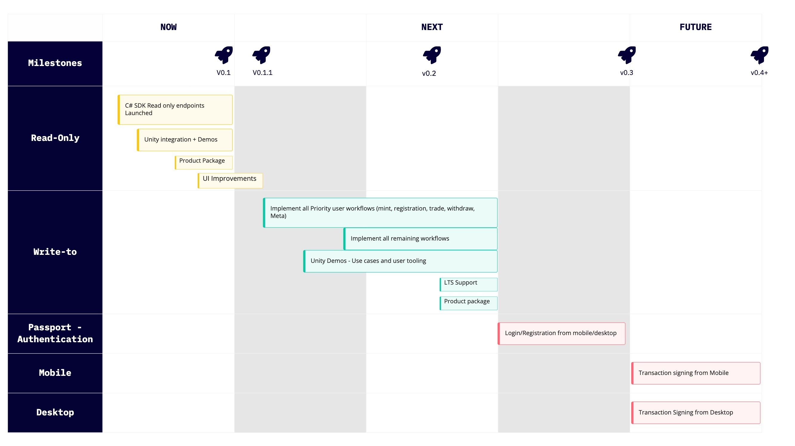

# Overview

The Immutable Core SDK C# provides convenient access to the ImmutableX API and Ethereum smart contracts for applications written on the ImmutableX platform.

Currently, this SDK supports interactions with our application-specific rollup based on StarkWare's [StarkEx](https://starkware.co/starkex/). In the future, when we start supporting other rollups, this SDK will also provide access to those.

:::info Read only functionality
Currently, the C# Core SDK provides ***read-only*** functionality. The endpoints supported are (from [this Changelog entry](https://github.com/immutable/imx-core-sdk-csharp/blob/main/CHANGELOG.md)):
* Assets: Get & List
* Balances: Get & List
* Collections: Get & List & List with filters
* Exchanges: Get & List
* Metadata: Get
* Mints: Get & List
* NFT Checkout Primary: Get & List transactions, Get currencies
* Deposits: Get & List
* Withdrawals: Get & List
* Transfers: Get & List
* Trades: Get & List
* Orders: Get & List
* Users: Get
* Tokens: Get & List

***Implementation roadmap:***
